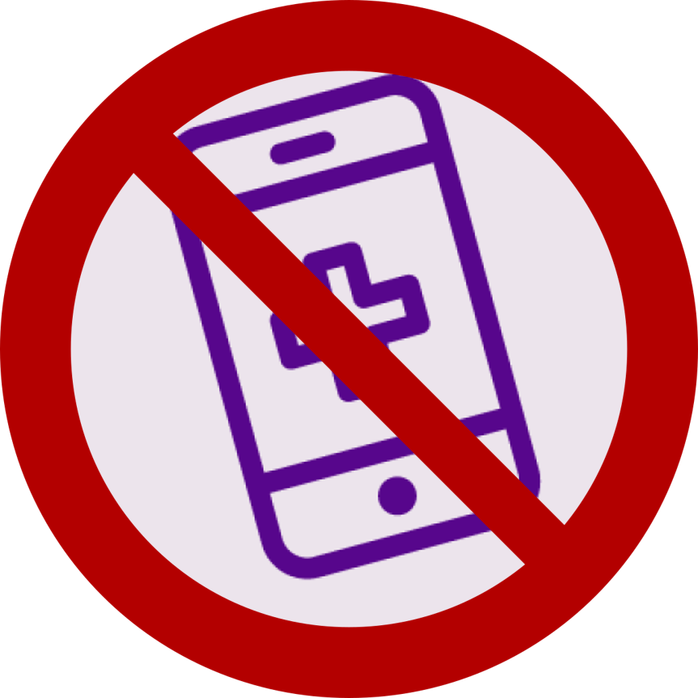

# Auto Daily Screener

  

**Currently broken due to update to Bye DUO so MFA doesn't work currently***

**If you don't mind a little work for doing daily screeners, just refreshing a completed daily screener tab from the previous day (or before) before will automatically generate a new screener for the current day. However, if you really want to have it be fully automated, then read on. **

This automates the NYU Daily Screener using Selenium by automatically going through the NYU web form and filling in all the details automatically. Windows only for now but should be relatively easy to port.

Credits to BYE DUO and DUO Bypass for the code generation code. Pyinstaller used for creating binary. There are no macOS or Linux binaries though both should be pretty easy to make.

## Requirements

- Need Windows and Google Chrome. 

## Build Instructions

I would recommend the precompiled releases for most people. However, if you want to be more trusting of this software or you want to compile this for different platforms, read ahead. Install Python 3 and download the source. Also download or manually compile a version of the chrome driver that matches your chrome version. Then install pyinstaller. Run this command in the source directory:

pyinstaller ads.py

The build should be found in the 'dist' folder that was just created. Place your chromedriver and credentials.json file there.

Also you can probably use other browsers if you want and compile this to different platforms.

## How does it work?

This runs a selenium script to automatically go through the form and then generates a code from a virtual device in order to bypass MFA. You can use external tools like the Windows Task Scheduler to have it run daily.

## How do I use this?

Video Tutorial: https://www.youtube.com/watch?v=W63eWNTG2W0

Read this or else this isn't going to work. The video is linked above. Otherwise, the written instructions are below.

### Making a new device

This script works by bypassing the NYU mfa but to do that, you'll need to create a new device. Here's how:

1. After submitting your username and password, you'll come to the NYU DUO multi-factor authentication page. Click 'Add a new device'

2. Just do your authentication with your standard device (probably your phone)

3. Now pick 'Tablet', 'Android', 'I have DUO mobile installed', and 'Email me an activation link instead'

4. Send the link to your email. Once you recieve it, **don't** click it (it's okay if you accidentally do). However, the link itself is what matters. (The link format is like this: https://m---------.duosecurity.com/android/--------------------)

5. Now open the ads folder. There will be a lot of files in there but don't touch most of them. Go to the "credentials.json" file and fill in your username, password, and deviceURL (the link you just got). Leave everything else the same. (Don't worry, this information is kept on your local device).

6. Now run the app (ads.exe) once. You'll see it generate a secret which means you did it right. If not, then the URL wasn't properly put in. You're almost there but you need to do one more thing. (Optionally you can create a shortcut of ads.exe by right clicking it and clicking "Create Shortcut")

7. Refresh the DUO mobile page (or just open a new window). Go to 'my settings and devices' and reauthenticate with your phone (or another device) like you did before. You should see a new Android device. For the default device option, set it to the new device you made and save. 

8. You're done! If you check your email, the confirmation message should appear soon. However, you still have to manually run the .exe everytime you want to run the script. What if could automatically be done for you...

### (Optional but recommeneded) Running the script daily

### Note: your computer must be on during that day before you go to class for this to be useful. However, setting it to run at midnight means that it likely won't inconvenience you.

1. Open up the Task Scheduler (just search it from the windows search box)

2. Right click on Task Scheduler library and click 'Create Basic Task'. Put a name and description (I put "Auto Daily Screener" for the name, how creative)

3. Have it run daily (lol) at 12:00 AM. You can leave the date and the recurrence the same. Then click 'start a program'. Browse to the ads.exe file and click on it. Now you'll want to copy the file directory to the "Start in" directory **without** the executable. Example: the program directory is "\..\ads\ads.exe". Thus, the start in directory should be "..\ads" without the final backslash character. Don't put "" when putting the paths into the task scheduler.  Click next and then finish.

4. Now right click on the task you just created and click properties. Click conditions and uncheck the box which says "Start the task only if the computer is on AC power". Next click settings and check the "Run task as soon as possible after a scheduled start is missed". Click ok. 

4. Voila! The script now runs at midnight meaning that you'll always have the daily screener ready before class in the morning. Hope you enjoy!
